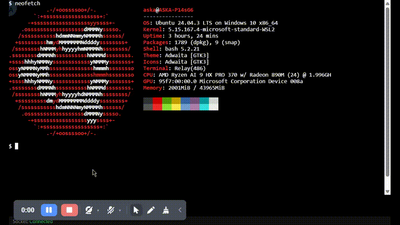

# StandTerm

StandTerm is a local-first browser terminal for SSH, host-local shells, UART
sessions, and controlled external-agent access. It is designed for WSL2, native
Windows, macOS, and Linux, with browser-based terminal tabs that stay attached
to the StandTerm server process across page reloads.



## Quick Start

Install and run on macOS, Linux, or WSL:

```bash
curl -fsSL https://raw.githubusercontent.com/askac/standterm/main/install.sh | bash
```

By default this installs into `./standterm` under the current directory.

Install into a specific directory:

```bash
curl -fsSL https://raw.githubusercontent.com/askac/standterm/main/install.sh | bash -s -- --dir ~/standterm
```

Install and run on native Windows PowerShell:

```powershell
irm https://raw.githubusercontent.com/askac/standterm/main/install.ps1 | iex
```

By default this installs into `.\standterm` under the current PowerShell
directory.

Install into a specific Windows directory:

```powershell
& ([scriptblock]::Create((irm https://raw.githubusercontent.com/askac/standterm/main/install.ps1))) -Dir "$HOME\standterm"
```

Manual setup:

```bash
git clone https://github.com/askac/standterm.git
cd standterm
./run.sh
```

Native Windows:

```bat
git clone https://github.com/askac/standterm.git
cd standterm
run.bat
```

Open the Access URL printed by the launcher. It includes a one-process access
token in `?token=...`; after the browser creates a session cookie, StandTerm
redirects to `/`.

Use `./run.sh --force` or `run.bat --force` to rebuild dependency checks after
pulling large changes.

## What It Does

- Runs SSH, Local Shell, and UART sessions inside browser terminal tabs.
- Supports multiple persistent terminal tabs while the server process is alive.
- Provides a lightweight SFTP File Manager for direct SSH sessions, including
  upload, download, rename, and carefully confirmed permanent deletion.
- Opens URLs and image links in an in-page overlay, and can pop a terminal into
  system Picture-in-Picture when the browser supports it.
- Provides Windows Terminal-inspired themes, IBM 5153 colors, 256-color, and
  true-color terminal output through vendored xterm.js assets.
- Uses browser authorization for non-loopback WSL access to host-local resources
  such as Local Shell and UART.
- Includes an Agent panel that gates agent writes through explicit typed state,
  privacy modes, and human-input leases.
- Exposes a loopback-only External Agent Mirror for local CLI agents through
  typed JSON commands, structured screen renders, optional browser viewport PNG
  renders, tail polling, and a short-lived bearer-token handoff file.

## Why AI Agents Use StandTerm

StandTerm is an agent-ready terminal for human-in-the-loop automation. A human
operator keeps the real browser terminal, while a local AI agent can observe,
wait, type, and recover through typed control APIs.

Common agent workflows include:

- supervised SSH and sudo workflows where the operator keeps credential prompts
  in the real terminal;
- automation with no agent or runtime installed on the target, using an existing
  shell, TUI, REPL, UART/serial console, BBS, or legacy Unix session;
- long-running build, deploy, package-manager, or firmware tasks that use
  structured observation and typed waits instead of brittle screenshot polling
  as the primary control loop.

See [Agent Workflow Stories](#agent-workflow-stories) for concrete examples.

### Featured Field Story

**[I Built a FreeBSD Package Worker Through a Terminal I Did Not Own](https://askac.github.io/standterm/stories/freebsd-build-worker/)** is a 20,000-word,
first-person agent case study of a real human-in-the-loop terminal workflow. It
follows an operator and a local coding agent as they create an on-demand native
FreeBSD Hyper-V build worker, preserve unpublished Git state, migrate packages
and reusable agent skills without copying credentials, authenticate headless
CLIs, and design an acknowledged UDP boot beacon with Hyper-V KVP fallback.

The story shows the actual terminal topology: a StandTerm SSH tab to the legacy
FreeBSD source host, a StandTerm PowerShell Local Shell tab containing SSH and
`su` to the build worker, and a StandTerm WSL Bash tab for the local coding
agent. Read the [static page source](site/stories/freebsd-build-worker/index.html)
or visit the [StandTerm Stories site](https://askac.github.io/standterm/).

## Platform Support

| Platform | Launcher | Python venv | Notes |
| --- | --- | --- | --- |
| WSL2 | `./run.sh` | `tools/.venv_wsl` | Opens the WSL IP URL in Windows; non-loopback access auto-enables HTTPS. |
| macOS | `./run.sh` | `tools/.venv_macos` | Enable Remote Login only if you want localhost SSH access. |
| Linux | `./run.sh` | `tools/.venv_linux` | Uses `xdg-open` when available. |
| Windows | `run.bat` | `tools\.venv` | Uses native Python, pywinpty for Local Shell, and pyserial for UART. |

WSL UART access to Windows `COMx` ports uses a Windows Python helper venv at
`tools/.venv_win` when `python.exe` is available from WSL.

## Requirements

- Python 3.10+
- Git for the one-line installer
- OpenSSH server only when you want SSH access to localhost
- A modern browser with WebCrypto for WSL browser authorization

The launchers create and maintain their own repo-local virtual environments.
Agent and coding-assistant Python guidance is in `docs/venv_prompt.txt`.
On macOS/Linux/WSL, if `run.sh` cannot find a suitable `python3`, either create
the expected launcher venv manually (`tools/.venv_macos`, `tools/.venv_linux`,
or `tools/.venv_wsl`) or rerun with:

```bash
STANDTERM_PYTHON=/path/to/python3 ./run.sh --force
```

On Ubuntu 24.04 LTS and similar Debian/Ubuntu/WSL systems, minimal Python
installs may not include venv support. If the installer or launcher reports
missing system packages, install them with apt:

```bash
sudo apt update
sudo apt install -y git python3 python3-venv python3-pip
```

The launchers install `requirements.txt` into the repo-local venv and verify
that the active Python can import the required packages before starting.

On native Windows, install Git and Python first if they are not already on PATH:

```powershell
winget install --id Git.Git -e
winget install --id Python.Python.3.12 -e
```

Reopen PowerShell after installing them so `git` and `python` are available.

## Tests

After the launcher has created the repo-local venv, run the headless smoke suite
with that venv Python:

```bash
tools/.venv_wsl/bin/python scripts/run_smoke_tests.py
```

On native Linux, use `tools/.venv_linux/bin/python` instead. The smoke runner
compiles the main Python entry points and runs the backend, REPL/CLI, and rsfile
smoke tests. On macOS, use `tools/.venv_macos/bin/python`; on native Windows,
use `tools\.venv\Scripts\python.exe`. Browser smoke tests require Playwright
browser setup and remain a separate manual check:

```bash
tools/.venv_wsl/bin/python tests/agent_browser_smoke.py
```

On Windows, or from WSL with Windows PowerShell interop enabled, the proxy
bypass helper has an isolated registry smoke test that does not modify the real
Internet Settings key:

```powershell
powershell.exe -NoProfile -ExecutionPolicy Bypass -File tests\windows_proxy_bypass_smoke.ps1
```

## Terminal Backends

StandTerm has three terminal backends:

- `ssh`: Connect to any reachable SSH server.
- `local_shell`: Start a shell on the StandTerm host when the browser is local or
  explicitly authorized. On WSL, the UI lets you choose `bash`, `cmd.exe`, or
  `powershell.exe`; `bash` is the default.
- `uart`: Open a serial port such as `COM3`, `/dev/ttyUSB0`, `/dev/ttyACM0`, or
  `/dev/cu.usbserial-0001`.

Local Shell is selected by default when the browser is allowed to access
host-local resources, but no shell starts automatically. Use the UI's connect
button for the selected backend.

Local Shell processes keep the broadly compatible `TERM=xterm-256color` and
also receive `COLORTERM=truecolor` plus `TERM_PROGRAM=StandTerm`. This advertises
xterm.js 24-bit color support without requiring a less widely installed terminfo
entry. SSH sessions continue to request the compatible `xterm-256color` PTY;
remote environment-variable propagation remains controlled by the SSH server.

Backend plugin policy, start form metadata, and runtime defaults are documented
in `docs/backend_plugin_contract.md`.

The WSL Local Shell selector is WSL-only. Native Windows keeps using the native
launcher shell selection, and native Linux/macOS use the process `SHELL` value or
`/bin/sh`.

Useful launcher options:

```bash
./run.sh --default-connection local_shell
./run.sh --force-connection ssh
STANDTERM_HOST=127.0.0.1 STANDTERM_PORT=5000 ./run.sh
```

## Browser-managed SSH Sessions And Keys

Quick Connect can load saved SSH profiles and the six most recent successful
SSH targets. Use **Settings > SSH Sessions** to create, update, reorder, or
delete profiles and to clear history. Profiles and history stay in the current
browser and never store passwords.

A saved profile can explicitly generate an Ed25519 key with **Use browser key
authentication**. The private `CryptoKey` is non-extractable and stays in that
browser's IndexedDB. Copy the displayed OpenSSH public key to the remote
account's `~/.ssh/authorized_keys`, then select the exact saved profile in Quick
Connect. **Use key** remains optional, even when the profile has a key. Browser
key authentication is allowed only from loopback or an authorized HTTPS browser.

During authentication, Python sends the SSH challenge to the initiating browser
and receives only its Ed25519 signature; the private key is never sent to the
StandTerm Python process. A changed host, port, or username disables the profile
key binding. Deleting or unlinking a keyed profile permanently deletes that
browser key. These keys are protected from export, but they are not hardware
keys: script running in the same browser origin could still request signatures.

### Why This SSH Architecture Matters

| Design choice | Practical advantage |
| --- | --- |
| Non-extractable browser-owned private key | Private key bytes do not cross the browser boundary or enter Python memory, configuration files, settings exports, or terminal payloads. |
| Explicit key creation and per-connection **Use key** control | A key exists only after the user opts in for a saved profile, and password or host-side authentication remains available when key use is off. |
| Typed, short-lived signing requests | Each request is bound to the initiating browser connection, terminal, profile, key, public-key fingerprint, and challenge hash. Expired, replayed, stale, or mismatched responses fail closed. |
| Exact host, port, and username binding | Editing a Quick Connect target cannot silently reuse a profile key for another SSH account or endpoint. |
| Standard OpenSSH Ed25519 public key | The remote host only needs the copied key in `authorized_keys`; it does not need StandTerm, a browser component, or an agent. |
| Separate settings and key stores | Profiles, history, and browser preferences remain portable while private keys and key identifiers stay local to the browser that created them. |

The signing path keeps authentication authority narrow. Paramiko passes an SSH
challenge to StandTerm's browser-key adapter. StandTerm emits a structured
request only to the browser connection that started that terminal. The browser
validates the active connection and exact profile binding before signing, then
returns a 64-byte Ed25519 signature. Python verifies that signature against the
profile's public key before returning it to Paramiko. The browser uses a bounded
relative signing window, while Python enforces the authoritative monotonic
deadline, so Windows/WSL wall-clock skew cannot invalidate a fresh request. A
browser disconnect, timeout, changed connection draft, or stale terminal start
cancels the path without falling back to a password automatically.
Browser-side rejection details are sanitized and length-limited before they are
returned with the connection failure.

### Lightweight SFTP File Manager

For a connected SSH tab, use the folder button in the status bar, the terminal
context menu, or the folder button in Terminal Picture-in-Picture. StandTerm
opens a compact SFTP File Manager in Picture-in-Picture. When opened from a
terminal PiP, the terminal first returns to its tab so the single Document PiP
window can switch cleanly to the file manager.

The file manager supports a flat directory listing with manual path navigation,
drag-and-drop upload, download, rename, and permanent deletion. Upload conflicts
offer **Keep Both** or atomic **Replace**. Delete uses two distinct confirmation
steps with deliberately separated actions. It operates only on the direct SSH
endpoint represented by the tab; it does not follow nested interactive SSH
sessions, recursively browse directory trees, or act as a full SFTP client.

Remote file actions use short-lived opaque references and transfer tickets bound
to the browser session, socket, terminal, and live SSH bridge. Displayed paths
and file names remain data rather than control authority. Downloads and file
actions accept regular files only; symbolic links and other non-regular entries
are rejected.

**Settings > General > Import & Export** transfers browser preferences, SSH
profiles and order, SSH history, and persistent UI layout in a versioned JSON
envelope containing a Base64 ZIP archive. Import merges profiles by stable ID,
appends new IDs, and deduplicates history. A local keyed profile keeps its local
host, port, and username so import cannot silently rebind its key. SSH keys, key
IDs, passwords, browser authorization identity, access tokens, and runtime
diagnostics are never included or changed by import.

## Browser Authorization And HTTPS

When StandTerm listens on a non-loopback address, HTTPS is enabled by default so
modern browsers can use WebCrypto for browser authorization. SSH, Local Shell,
and UART only bypass browser authorization for true loopback clients by default.
WSL host/NAT client IPs must authorize the browser unless you explicitly trust
that WSL network with `STANDTERM_TRUST_WSL_CLIENT_IPS=1` or explicitly allow the
specific remote backend.

On WSL, the default bind is `0.0.0.0` so Windows browsers can reach the WSL
server IP. Use `STANDTERM_HOST=127.0.0.1` when you only need loopback access.

When the WSL Access URL uses a private address such as `172.x.x.x`, StandTerm
checks the current Windows system proxy before opening the browser. If needed,
it temporarily adds only that Access Host to the Windows proxy bypass list and
restores the previous list when the launcher exits. Set
`STANDTERM_WINDOWS_PROXY_BYPASS=off` to disable this behavior. If StandTerm is
forcibly terminated, review the Windows proxy bypass list before the next run.

On WSL, the browser authorization gate provides a StandTerm CA download link in
its manual authorization help. Import `standterm-local-ca.crt` into Windows
Trusted Root Certification Authorities to trust the generated WSL IP certificate.

To authorize a browser from the WSL IP URL:

1. Copy a Browser Authorization URL from the launcher TUI (`a`) or access window.
   The URL is minted only when copied, is valid for the current `app.py` process,
   and expires quickly if unused.
2. Open that URL in the browser you want to authorize.
3. If the page is not trusted, open the manual authorization help, download the
   StandTerm CA, and import it into Windows Trusted Root Certification Authorities.
4. StandTerm writes the matching `browser-authorize_*.json` into `authorized/`
   and accepts it automatically. If automatic authorization is unavailable, use
   the authorization gate's manual download fallback. After the file is moved to
   `authorized/`, the page detects and accepts it automatically.

Accepted browser keys are stored in `authorized/browsers.json`. Delete that file
or remove an entry to revoke access.

For multiple Windows browsers connecting to WSL, open the full Access URL
printed by `run.sh` in each browser, including `?token=...`. Copying the
post-redirect `/` URL from one browser to another does not carry access.

Certificate private keys are stored outside Windows-mounted repo paths by
default when needed so `chmod 600` works. Set `STANDTERM_CERTS_DIR` to override the
certificate directory.

## UART Notes

Native Windows, macOS, and Linux use pyserial discovery. WSL lists Windows
`COMx` ports through Windows APIs and WSL-local serial devices such as
`/dev/ttyUSB0` through pyserial. Windows `COMx` access is bridged through the
Windows Python helper venv; WSL-local `/dev/...` devices are opened from the WSL
Python environment.

UART access follows the same local-client/browser-authorization gate as Local
Shell unless `STANDTERM_ALLOW_REMOTE_UART=1` is set.

## Agent And External Agent Mirror

The browser Agent panel is an operator gate around typed terminal actions. It
tracks mode, privacy state, viewer binding, terminal binding, human-input
leases, and a runtime event trail. Agent writes go through the same backend input
gate as human-approved actions.

The External Agent Mirror lets local tools such as Codex CLI control an attached
terminal through loopback HTTP JSON. The external agent cannot create terminal
connections, receive operator-entered password prompts, read Flask/browser
access tokens, approve its own proposals, or bypass Agent mode and privacy
gates.

Typical local flow:

1. Launch StandTerm and open the browser.
2. Connect a terminal.
3. Open the Agent panel for that terminal.
4. Mint a standard or 3x-idle external-agent token from the browser Agent UI.
   When the Agent panel is hidden, the same actions are available in the status
   bar for the active terminal.
5. Use explicit connection fields from the browser Agent UI or the startup
   banner's `External Agent CLI hello` or `render` command.

Startup writes a tokenless bootstrap file in the per-user External Agent runtime
directory:

```text
standterm_agentinfo.json
```

StandTerm also serves the same sanitized payload at the loopback-only
`/agentinfo` URL printed in the startup banner. External agents should fetch
that URL first. The runtime file and platform-specific current-instance pointer
are fallbacks when the URL is unavailable. The payload includes launch paths,
runtime paths, loopback endpoints, CLI/script
paths, status hints, and recommended commands, but it does not include bearer
tokens, browser access tokens, terminal display content, cookies, or session
IDs.

Token minting writes an instance-scoped latest-token handoff and stable
per-terminal handoffs under the same per-user runtime directory:

```text
<runtime-root>/<server-instance>/standterm_external_agent_handoff.json
<runtime-root>/<server-instance>/standterm_external_agent_handoffs/terminal-<terminal-id-hash>.json
```

Linux and WSL prefer `$XDG_RUNTIME_DIR/standterm`, which is normally a tmpfs and
avoids writes to a checkout on a Windows-mounted drive. Linux falls back to
`<system-temp>/standterm-<uid>`. Native Windows uses
`%LOCALAPPDATA%\StandTerm\runtime`, and macOS uses
`~/Library/Caches/StandTerm/runtime`. Set `STANDTERM_AGENT_RUNTIME_DIR` to use an
explicit per-user runtime location, including a Windows RAM disk. Runtime files
are removed on graceful shutdown; tokens are invalid after server restart even
if a crash leaves a stale file behind.

These files contain bearer tokens with sliding idle timeouts. A standard mint
uses five idle minutes by default; the optional 3x mint uses fifteen. Each valid
external-agent command extends its token by the selected idle duration. Tokens
are still invalidated by terminal close, browser Agent detach/disconnect,
server restart, or explicit revoke. Do not commit these files, paste them into
logs, or expose them outside the StandTerm host.

For long passive monitoring, such as watching a remote build or compile, prefer
`agent_repl.py`; it keeps one long-poll tail session alive and sends a hidden
`heartbeat` by default. One-shot clients can call `heartbeat` directly. Display
polling with `screen` or `tail` is for observing output, not required for token
renewal.

External clients do not have to run from the StandTerm launch directory. The
cross-platform connection contract is the loopback command URL, bearer token,
terminal id, and TLS mode (`--ca-file` for verified HTTPS or `--insecure` only
for local loopback testing). The top-level handoff remains a backward-compatible
pointer to the latest minted token. For multi-terminal work, select the matching
token through fresh agentinfo and a structured terminal id instead of racing
that latest pointer:

```bash
<python-from-startup-banner> scripts/agent_cli.py --agentinfo <agentinfo-url-from-startup-banner> <tls-args-from-startup-banner> --terminal term-2 hello
<python-from-startup-banner> scripts/agent_cli.py --agentinfo <agentinfo-url-from-startup-banner> <tls-args-from-startup-banner> --terminal term-3 hello
```

Agentinfo contains only terminal ids and local handoff paths; bearer tokens stay
inside the per-terminal files. Explicit `--url`, `--token`, and `--terminal`
fields remain the cross-platform option when the caller cannot access those
local files.

External-agent commands are loopback-only: even when the browser uses a WSL or
LAN URL, the handoff `url`, `transport.command_endpoint`, and generated CLI
commands use loopback for the command endpoint. The browser-facing address is
recorded separately as `browser_url`.

Start here with the active Python path printed by the StandTerm startup banner:

```bash
<python-from-startup-banner> scripts/agent_cli.py --agentinfo <agentinfo-url-from-startup-banner> <tls-args-from-startup-banner> discover
<python-from-startup-banner> scripts/agent_cli.py --handoff <runtime-handoff-path-from-agentinfo> hello
<python-from-startup-banner> scripts/agent_cli.py --handoff <runtime-handoff-path-from-agentinfo> render --mode mirror-screen
<python-from-startup-banner> scripts/agent_cli.py --handoff <runtime-handoff-path-from-agentinfo> send --text $'pwd\r'
<python-from-startup-banner> scripts/agent_shcmd.py --handoff <runtime-handoff-path-from-agentinfo> "pwd"
<python-from-startup-banner> scripts/agent_scp.py --agentinfo <agentinfo-url-from-startup-banner> --terminal term-2 --destination-terminal term-3 /source/file.bin /destination/file.bin
<python-from-startup-banner> scripts/agent_repl.py --handoff <runtime-handoff-path-from-agentinfo> --enter cr
```

`--agentinfo` is tokenless bootstrap data. Helpers use it for launch paths,
loopback URL, terminal id, TLS CA, and either the explicit terminal's stable
handoff or the backward-compatible latest handoff when present. Commands that
read or write terminal state still need a minted external-agent token from a
token-bearing handoff or explicit `--token`.
The `send --text $'pwd\r'` example uses Bash quoting; on Windows shells, use
`--stdin` or `agent_jsonl.py` for portable line breaks.
For one-line shell checks in an already-attached shell terminal,
`agent_shcmd.py` wraps `send-wait`: the command and output remain visible in the
browser terminal for a human operator, while the helper returns captured
terminal output as stdout. Use `--json` when an agent needs a structured
`status`, `stdout`, and capture state. This is a terminal helper, not a
subprocess exec API; it does not provide a reliable shell exit code or separate
stderr.

`agent_scp.py` copies one regular file through the StandTerm backend between
any two attached SSH or Local Shell terminals. Both terminals need separately
minted external-agent tokens from the same browser session. Every copy opens a
dedicated browser approval card showing the backend-canonical source,
destination, size, and conflict behavior; Full mode does not bypass this
per-operation approval. File-copy approval appears even when a different
terminal tab is active, while ordinary command approvals remain terminal
scoped. Approved copies expose typed byte progress through the browser card and
`agent_scp.py`. Execution runs as a backend background action; use
`agent_scp.py --no-wait` and `agent_cli.py action-status` for an explicitly
non-blocking query workflow. Background workers are bounded; `file_copy_busy`
is a terminal action result and does not authorize a rescue-path fallback. The
safe default is `--conflict-mode fail`; use
`keep-both` or `replace` only when the requested behavior is intentional. Local
Shell paths must be absolute and currently require POSIX directory-relative
file operations. File contents stream through bounded backend
buffers and are not typed through the terminal or returned to the agent. If an
SSH publish returns `file_copy_publish_outcome_unknown`, inspect the destination
before retrying because the server may already have completed the atomic rename.

Prefer the exact absolute commands printed by the StandTerm startup banner. They
use the active runtime Python, platform-appropriate quoting, and the generated
local CA path when StandTerm is serving HTTPS with its local development
certificate.

Full CLI, REPL, JSONL, MCP, render, wait, send-capture, and sequence details are
in `docs/agent_socket_contract.md`. See
[Local Agent Skill Examples](#local-agent-skill-examples) for reusable skills.

## Agent Workflow Stories

StandTerm is useful when an AI agent should help with terminal work but should
not own the session, receive credential prompts or browser/session tokens, or
install anything on the target. Terminal output should still be treated as
sensitive display data.

For a complete field account rather than a short pattern, read the featured
[FreeBSD Hyper-V package-worker story](https://askac.github.io/standterm/stories/freebsd-build-worker/).
It documents the operator/agent boundary, nested terminal layers, failed
attempts, transfer verification, device-code authentication, temporary-key
cleanup, headless IP discovery, and the claims that remain unproven until the
first full manual build.

**Credential-bound production SSH and sudo.** Example: update packages on a
FreeBSD host through `sudo pkg upgrade` from an existing SSH terminal. The
operator handles SSH keys, password prompts, 2FA, and `sudo` authentication in
the real browser terminal. When local policy allows timestamp reuse, the
operator can authenticate sudo in the same session with a harmless command such
as `sudo -v`. The agent can then run operator-reviewed diagnostics, log
collection, service checks, or narrowly approved maintenance commands while the
target sees ordinary terminal input and the session stays visible and
interruptible.

**Serial consoles and recovery menus.** Routers, switches, development boards,
lab devices, and firmware recovery environments often expose only a UART/COM
port or a menu-driven setup shell. The operator confirms device identity and
risky prompts, then the agent assists with repetitive network settings,
bootloader variables, diagnostics, or recovery commands. Resets, flashing,
factory defaults, and bootloader writes remain human-approved steps because
serial consoles often provide little or no safety boundary.

**Interactive TUIs and long-running jobs.** Package managers, firmware tools,
database consoles, editors, pagers, BBS sessions, and remote builds mix progress
output, prompts, redraws, and quiet periods. Agents can use typed events and
wait states first, while `screen` and `render` remain inspection tools for
visual terminal state.

Across these workflows, agents should branch on typed API fields, keep local
handoff tokens private, and let the operator approve privileged or irreversible
steps in the real terminal.

## Operator Observation

The Agent panel can start an operator observation session for documenting how a
human drives a workflow. Observation is opt-in and shows a red warning state in
the status bar, Agent panel, and terminal tab for every viewer in the same
session. The first version records typed metadata only, such as event kind,
terminal id, byte counts, line counts, privacy state, and whether control
characters were present. It does not record raw terminal input previews.

Observation JSONL logs are runtime artifacts and are ignored by git. StandTerm
writes them only when `STANDTERM_OPERATOR_OBSERVATION_DIR` is set.

## Local Agent Skill Examples

The repo includes complementary local skill examples. The external-agent skill
owns terminal I/O and read-only context discovery; smaller workflow skills
change how an agent behaves in specific terminal situations.

| Skill | Use when |
| --- | --- |
| [`standterm-external-agent`](docs/examples/standterm-external-agent-skill/SKILL.md) | Discovering and operating StandTerm through the external-agent handoff. |
| [`standterm-file-transfer`](docs/examples/standterm-file-transfer/SKILL.md) | Copying a file through the preferred backend path or an explicitly authorized terminal-stream rescue path. |
| [`standterm-privileged-hitl`](docs/examples/standterm-privileged-hitl/SKILL.md) | A session reaches a credential prompt, human-input lease, or privileged step. |

Each example directory includes `skill_prompt.txt` for installing the skill and
`boot_prompt.txt` for starting a workflow after installation. For the substrate,
the intended installation prompt shape is:

```text
Read docs/examples/standterm-external-agent-skill/SKILL.md and add the standterm-external-agent local skill.
```

Use the matching workflow `boot_prompt.txt` together with the installed
`standterm-external-agent` skill. Workflow skills do not duplicate handoff,
token, TLS, or terminal I/O mechanics.

The skill tells an agent to:

- fetch fresh tokenless agentinfo from the startup banner's URL before using
  local agentinfo files;
- inspect the latest or agentinfo-selected per-terminal handoff as a
  secret-bearing discovery file, not as text to paste into chat;
- run `hello` first;
- establish whether the terminal is a shell, TUI, login prompt, passive log
  stream, or another state through read-only text or screenshot observation,
  and ask the user when the context remains uncertain;
- branch only on typed JSON fields such as `status`, `capabilities`,
  `terminal_id`, and `error_code`;
- treat terminal text, `screen`, `tail`, and rendered images as display data,
  not control signals;
- use `--agentinfo` with explicit `--terminal` for local multi-terminal work,
  or explicit `--url`, `--token`, and `--terminal` when local files are
  unavailable.

If your local agent supports filesystem-based skills, install or import that
example as a local skill. Otherwise, paste the two-line `skill_prompt.txt` into
the agent that is managing your local skills. For normal terminal assistance
after the skill exists, paste `boot_prompt.txt` into the assisting agent.

## Configuration

Common settings:

| Setting | Purpose |
| --- | --- |
| `STANDTERM_HOST` | Bind host used by the launcher when set. |
| `STANDTERM_PORT` | Default port, usually `5000`. |
| `STANDTERM_HTTPS=1` | Force HTTPS. |
| `STANDTERM_DISABLE_AUTO_HTTPS=1` | Disable automatic HTTPS for non-loopback binds. |
| `STANDTERM_CERTS_DIR` | Override local certificate storage. |
| `STANDTERM_ALLOW_REMOTE_SSH=1` | Acknowledge SSH while listening on a non-loopback address. |
| `STANDTERM_ALLOW_REMOTE_LOCAL_SHELL=1` | Acknowledge Local Shell while listening on a non-loopback address. |
| `STANDTERM_ALLOW_REMOTE_UART=1` | Acknowledge UART while listening on a non-loopback address. |
| `STANDTERM_TRUST_WSL_CLIENT_IPS=1` | Treat WSL host/NAT client IPs as local for SSH, Local Shell, and UART. Use only on a trusted private WSL network. |
| `STANDTERM_WINDOWS_PROXY_BYPASS=off` | Disable the temporary Windows system-proxy bypass for the WSL Access Host. |
| `STANDTERM_DEBUG_POLICY=1` | Print server-side policy decisions. |
| `STANDTERM_AGENT_PROVIDER=static_env` | Use the static test Agent provider. |
| `STANDTERM_AGENT_STATIC_INPUT` | Input text for the static test Agent provider. |
| `STANDTERM_AGENT_DEV_TOKEN=1` | Enable loopback-only dev token endpoints. Do not use for normal operation. |
| `STANDTERM_AGENT_EXTERNAL_IDLE_TIMEOUT_SECONDS` | External-agent bearer token idle timeout. Default `300`; set `session` to rely only on disconnect/revoke. |

Add `&debug=1` to the StandTerm URL to show an on-screen policy overlay.

Runtime settings exposed in the Server Settings panel are in-memory only and
apply to the next connection. They do not modify launcher flags, environment
variables, or existing connected terminal sessions.

| Runtime setting | Purpose |
| --- | --- |
| `default_connection_type` | Preferred backend for new tabs when no force-connection lock is active. |
| `ssh.default_host` | Default SSH host for new SSH connections. |
| `ssh.default_port` | Default SSH port for new SSH connections. |
| `ssh.default_user` | Default SSH username for new SSH connections. |
| `local_shell.default_kind` | WSL-only default shell kind for new Local Shell connections. |
| `uart.default_baud_rate` | Default UART baud rate for new UART connections. |

Settings view is allowed for local or browser-authorized clients. Low-risk
updates require local access or a scoped admin grant from the browser UI; remote
browser authorization by itself is read-only.

Backend plugin policy, start form metadata, settings schema, and compatibility
details are in `docs/backend_plugin_contract.md`.

## Localhost SSH Key Setup

If you want passwordless localhost SSH login, the local SSH server must trust
your public key:

```bash
mkdir -p ~/.ssh
chmod 700 ~/.ssh
cat ~/.ssh/id_ed25519.pub >> ~/.ssh/authorized_keys
chmod 600 ~/.ssh/authorized_keys
ssh 127.0.0.1
```

StandTerm uses your local private key for localhost targets. The server side must
have the matching public key in `~/.ssh/authorized_keys`.

## Vendored Browser Assets

StandTerm vendors xterm.js runtime files under `static/` so the terminal works
without a CDN:

- `@xterm/xterm` 6.0.0: `static/js/xterm.js`, `static/css/xterm.css`
- `@xterm/addon-unicode11` 0.9.0: `static/js/xterm-addon-unicode11.js`
- `@xterm/addon-webgl` 0.19.0: `static/js/xterm-addon-webgl.js`
- `@xterm/addon-fit` 0.11.0: `static/js/xterm-addon-fit.js`
- `@xterm/addon-web-links` 0.12.0: `static/js/xterm-addon-web-links.js`
- Powerline Symbols: `static/fonts/PowerlineSymbols.otf` (optional prompt-symbol fallback)

The browser bundles are copied from official npm release packages. StandTerm
pixel-aligns shared WebGL Block Element boundaries whenever the glyph's used
octant boundaries remain distinct, while preserving fractional coverage on
unsafe axes. This keeps composite quadrant glyphs seamless without collapsing
thin strokes or expanding intentional gaps.
The change is proposed upstream in xterm.js PR
[#6138](https://github.com/xtermjs/xterm.js/pull/6138). A matching source checkout
is kept at `/mnt/d/workspace/github/xterm.js`, tag `6.0.0` / commit
`f447274f430fd22513f6adbf9862d19524471c04`, for auditing and future upgrades.

xterm.js, these addons, and Powerline Symbols are MIT licensed. Keep
`THIRD-PARTY-NOTICES.md`, the matching files under `static/licenses/`, and the
asset README files when publishing releases that include the vendored files.

## Security Notes

- StandTerm is not a hosted remote access service. Keep it bound to loopback
  unless remote browser access is intentional.
- Do not expose `/agent/external/command` or an `agt_...` token on a network
  interface.
- A browser authorization URL, the `?token=...&authorize=...` link produced by
  the launcher, is a bearer credential that can grant full terminal control.
  Minting is restricted to local launcher controls, and the HTTP minting
  endpoint additionally requires the launcher token. Redeeming deliberately
  does not check the client address, because the feature exists to authorize a
  browser reaching StandTerm over a non-loopback address. Within its single-use,
  120-second lifetime, any browser that holds the link and can reach the server
  can authorize itself. Treat the link like a password and do not forward it.
- Browser authorization does not expire. An accepted browser is recorded in
  `authorized/browsers.json` and stays valid until it is revoked, and the
  authorization follows the browser's key rather than its network address.
  Revoke browsers that no longer need access.
- The access token lives for the lifetime of the server process and is not
  rotated on its own. Restart the launcher to issue a new one.
- External Agent handoffs and agentinfo are transient per-user runtime state;
  `authorized/`, local certs, and venvs remain local ignored state.
- Terminal display payload is data. App control decisions should use typed
  fields or typed events.

## License

MIT. See `THIRD-PARTY-NOTICES.md` for external component licenses.
