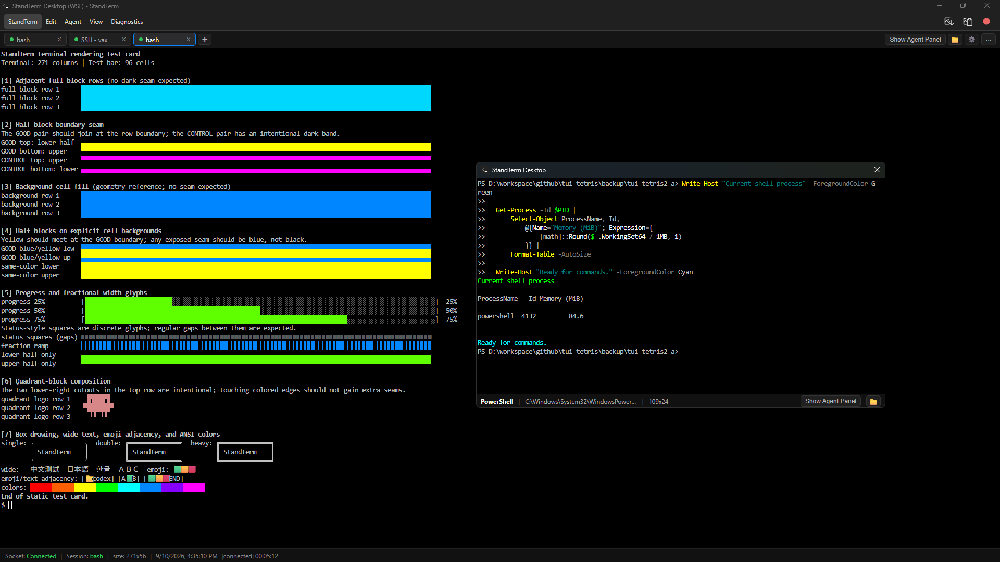

# StandTerm

A terminal built for humans and AI agents to share, observe, and control live sessions safely.

An open-source, local-first SSH client and serial terminal for Windows, macOS,
Linux and WSL. Connect to SSH, UART/COM, Telnet and local shells through a browser
or the optional Desktop app.

[Desktop downloads](#desktop-downloads-evaluation) · [Quick start](#quick-start) ·
[User guide](docs/user-guide.md) · [Agent setup](docs/user-guide.md#agent-and-external-agent-mirror)



*Desktop preview; current controls may differ.*

## Features

- **Visual SSH jump routes.** Connect through up to three jump hosts, with
  separate login and host-key verification at each hop. See where a connection
  stops and retry that login without restarting the completed hops.
- **Integrated SFTP and cross-tab file transfer.** Browse, upload and download
  files, or stream a file between connected SSH tabs through Core. Move build
  artifacts and logs without a manual download-and-upload round trip.
- **Live SSH port forwarding.** Add or stop local and remote TCP forwards on an
  existing connection, with connection counts and traffic indicators. Reach
  services behind jump hosts without reconnecting your terminal.
- **Browser-held SSH keys.** Generate non-extractable Ed25519 keys and sign in
  the browser, keeping private key bytes out of the Python backend. Settings
  exports exclude private keys; see [key management](docs/user-guide.md#browser-managed-ssh-profiles-and-keys).
- **Cross-tab AI collaboration.** Let an external AI agent observe and operate
  the SSH tabs you authorize, comparing configurations or correlating logs
  across hosts. Each tab retains its own permissions, with human-in-the-loop
  approval, pause and revocation controls.

AI access uses the CLI, JSON API or optional MCP adapter; no AI runtime is
required on the SSH targets. AI collaboration is optional.

## Examples

- [Compare two SSH hosts](docs/examples/ssh-cross-tab.md): one agent works across
  existing sessions while you review proposed diagnostic commands and results.
- [Work with tmux](docs/examples/ssh-tmux.md): keep remote jobs running across SSH
  disconnects, and use StandTerm for the visible terminal and optional AI help.

## Desktop Downloads (Evaluation)

[Download StandTerm Desktop](https://github.com/askac/standterm/releases/tag/desktop-v0.5.4-dev-2.15.0-dev)
for **Windows x64** or **macOS Apple Silicon**. Packages include the app and Core;
Python 3.10+ with venv support is required separately, and WSL mode needs an
existing WSL distribution.

These are evaluation builds. Check the release notes for bundled versions,
signing status and known issues; source features may be newer than the packages.
See the [Desktop guide](desktop/README.md) for installation and troubleshooting.

## Quick Start

For browser-based Core, install Git and Python 3.10+ with venv support, then run:

**macOS / Linux / WSL**

```bash
curl -fsSL https://raw.githubusercontent.com/askac/standterm/main/install.sh | bash
```

**Windows PowerShell**

```powershell
irm https://raw.githubusercontent.com/askac/standterm/main/install.ps1 | iex
```

Open the Access URL printed by the launcher. Installers use `./standterm` in the
current directory; [manual setup and prerequisites](docs/user-guide.md#quick-start)
are in the user guide.

## Documentation

- [User guide](docs/user-guide.md): connections, files, tunnels, settings and security.
- [Agent setup and reusable skills](docs/user-guide.md#local-agent-skill-examples).
- [CLI, JSON and MCP reference](docs/agent_socket_contract.md).
- [Real workflow stories](https://askac.github.io/standterm/).
- [Report an issue](https://github.com/askac/standterm/issues).

MIT licensed. See [third-party notices](THIRD-PARTY-NOTICES.md) for bundled components.
